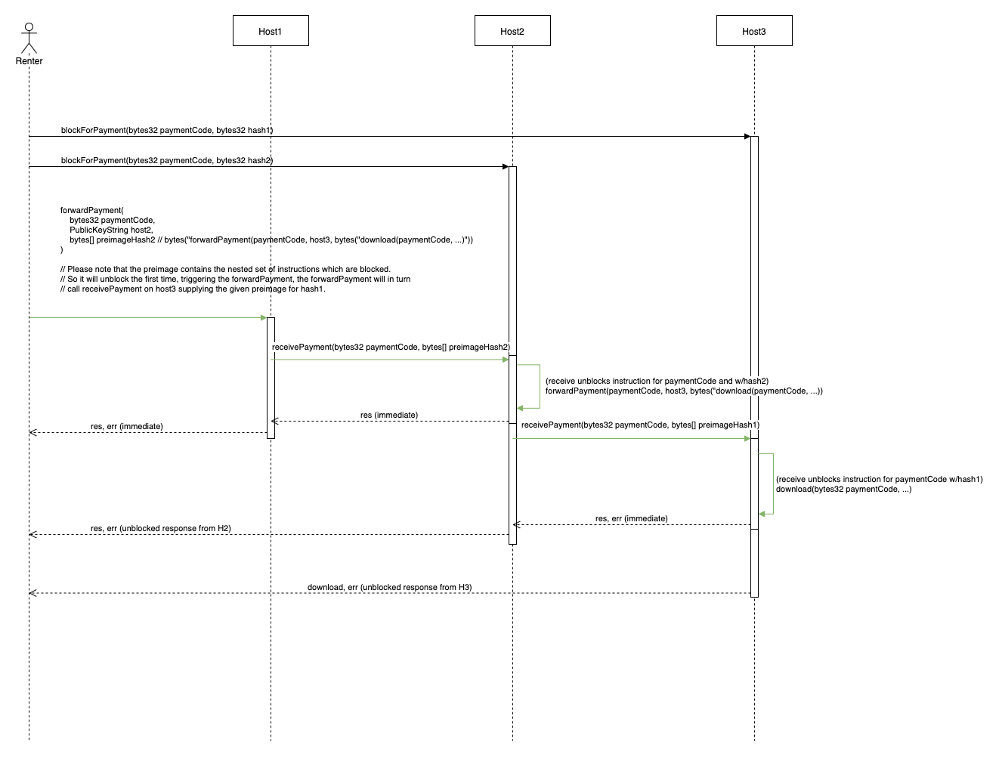

# SIP-0002 Payment Routing

SIP-0002 is a description of a payment routing system between hosts in the Sia
network. It outlines in detail the requirements for such a system and proposes a
series of logical [steps](#implementation-steps) that can be implemented through
separate MRs in order to successfully accomplish the goal outlined in the
description.

## Description

Payment routing is the act of routing a payment through potentially a series of
interconnected payment hubs. This payment can originate from multiple types of
sources, be it renters, hosts or eventually even non-Sia users. Routing payments
effectively enables performing actions on hosts with which you don't necessarily
share an immediate payment link.

## Motivation

Two of the most attractive use cases for Sia are filesharing and content
distribution. For both cases, a user will often be required to make a
micropayment to a host, where they don't have a pre-existing payment channel
with that host. By implementing payment routing we enable anybody that has an
existing payment channel with a host, to pay those hosts on behalf of somebody
else. These pre-paid actions can then be reclaimed by anyone who has knowledge
of the payment code. This way a user can fulfil an action on a host without
necessarily paying for it in that same request.

## Concepts

### Payment Code

Instead of all payments being required to come from either a siacoin input or by
being paid through the file contract, we should add an option to all of our
payment RPCs (including Form Contract and Renew Contract) to instead accept an
outsourced payment by supplying it with a payment code.

This new form of payment method is called `EphemeralPaymentMethod`. The word
ephemeral comes from the fact that these accounts will not be persisted, the is
no record of its existance besides the two parties that know the account is
supposed to be there.

Having these ephemeral accounts that can be prefunded saves an fsync when the
actual payable RPC is triggered by the end user. This is hugely beneficial as
pre-paid downloads for example could have multiple requests running in parallel
avoiding the necessity to lock the contract for revision updates.

These payment codes should not represent a single action but rather allow for a
series of actions to be prepaid. The amount of money here is in theory
completely arbitrary but it should be an amount of money that you are ok with to
lose. If the host which you prefund decideds to go rogue you effectively lose
all money you pre-funded with no way of reclaiming it.

A slight concern for the time being is the trustlessness of this setup. However
through the fact that we use packetized payments, this risk is minimized as the
loss each party can incurr is minized by the fact we pay in very small
increments, and thus losses are negligible should a node decide to go rogue and
run with the money.

### Payment Edge

In order to route a payment there needs to be a payment vessel between two
hosts. This channel can be a one way channel but ideally is a two-way payment
channel between two hosts in the network.

#### Payment Edge Builder

File contracts can be used to create such a channel and we will introduce a new
entity called `PaymentEdgeBuilder` that will be responsible for constructing
these special file contracts. Code will need to be written in order to support
the behaviour of two way payments through a file contract, as up until now it
only supported one way payment from renter to the host.

These 'payment contracts' would essentially ignore the necessity to provide
proof of storage and simply have a merkle root of zero. The two participants in
the channel can move money around by signing off on contract revisions that get
passed between both parties.

```Go
// PaymentEdge defines a link between two nodes through which payment can be
// routed. Every edge comes with a cost and latency.
type PaymentEdge struct {
    source          types.SiaPublicKey      `json:"source"`
    destination     types.SiaPublicKey      `json:"destination"`
    cost            types.Currency          `json:"cost"`
    latency         time.Duration,          `json:"latency"`
}
```

#### Payment Edge Pricer

Creating and maintaining these payment channels comes at a cost. This cost will
need to be fully recuperable through fees taking on the payment routing if the
payment network is to be successful and have proper incentivization structures.

The `PaymentEdgePricer` is responsible for pricing these edges, seeing as the
price is probably dependant on a couple of factors. In theory however it should
be possible to use fixed prices, although that might prove to be not very viable
as it'll be hard to be competitive with payment hubs that offer dynamic pricing.

Some thoughts on pricing:

- Nodes should be able to arbitrarily set the fee they want to charge for
  payment routing, meaning they will need full control and final say on the
  price, just as hosts currently can set fixed prices for up- or
  downloadBandwith

- Seeing as a depleted channel requires renewal or refreshing a contract, it
  might make sense to charge more if you want to route a payment through a
  channel that will get depleted as the result of it

### Payment Hub

A `PaymentHub` is a node that acts as a payment routing hub in the network. Just
as hosts are incentivized to host their storage space, payment hubs are nodes
which provide payments channels to other nodes and are incentivized to do so
through the fees they collect from the actual routing of these payments.

#### Payment Hub Locator

A `PaymentHubLocator` is an entity which listens and indexes
`PaymentHubAnnoucement`s on the network and can tell you which IP and contract
id to send money to if you are trying to fund an ephemeral account. More on that
later.

#### Payment Destination List

Every payment hub will only have a certain set of connections open to other
nodes and have a limited set of payment channels. Every node that is reachable
forms a payment edge and all of those together comprise the the
`PaymentDestinationList`. In other words it is basically a list of priced edges
that are reachable through the node you are talking to.

### Payment Network Rebalancer

It is to be expected that these payment channels get out of balance and become
one-sided after a while. This depletion of a channel's capacity is an issue
seeing as it means either a channel has to be reopened or funds need to move in
the other direction to rebalance the channel.

Ideally we devise an algorithm that automatically rebalances these channels to
avoid the otherwise necessary renewal of a FileContract. However for the time
being the plan is to settle the contract and recreate it when this event occurs.

### Topology Builder

The `TopologyBuilder` is the entity that can map the entire network topology. It
connects to the `PaymentHubLocator` to source its information from. Using this
it gets a list of all the `PaymentHub`s on which you can query the payment
destination list. By aggregating all of that information cross all hubs you can
essentially build up a complete network graph or topology locally.

```Go
// Topology is specific to a payment hub and is comprised out of a collection
// of payment edges the hub advertises. Every edge represents a payment route.
type Topology struct {
    paymentHub      types.SiaPublicKey      `json:"host"`
    edges           []types.PaymentEdge     `json:"edges"`
}
```

### Ephemeral Payment

We have already briefly touched on the subject of ephemeral accounts, these
accounts offer the ability to make ephemeral payment. This is essentially a new
form of payment method where instead of paying for something directly, you
supply a payment code. Only the person that pre-funded the ephemeral account and
the payment hub know about the payment codes. Knowledge of said code thus equals
ownership. By sharing it you are effectively making payment in behalf of
somebody else, allowing them to request a prepaid action on a host.

The current RPC instructions will need to be extended with this new form of
payment type. Whenever executed they will block that code until payment has been
made. In most cases however these actions will be pre-paid and the block will be
lifted immediately allowing fast and concurrent access.

For more detailed descriptions see the [RPC section](#RPCs)

### Accountability Manager

The `AccountabilityMananger` will properly handle a failed routing request. It
can try and reroute the payment and possibly penalize the node that failed to
properly complete the request.

## RPCs

This section will provide an overview with the required changes to the RPC set.
Both changes to the already existing RPCs as well as new additions are
discussed.

Payable RPCs, such as `FormNewContract` or `Read` (which is essentially
download), currently implement a form of direct payment. This direct payment is
done by exchanging money through updating and signing a contract revision. All
of the RPCs which currently support this "direct payment method" could
eventually also support the new "ephemeral payment method".

Note that an RPC with an ephemeral account as payment method which is not
prefunded will block until the account holds enough funds to successfully
complete the RPC. This blocked request will expire and resolve in failure after
a certain timeout.

- `listPaymentDestinations`  
  This RPC will return all of the possible payment destinations a payment hub
  offers. The result of this request is aggregated across multiple payment hubs
  and thus forms network topology. The `TopologyBuilder` does this.

- `fundEphemeralAccount`  
  This RPC funds an ephemeral account on a host. It requires an amount of SC
  that needs to be prefunded as well as a contract id. This RPC requires payment
  as it effectively credits money to an account.

- `forwardEphemeralPayment`  
  This RPC instructs to fund an ephemeral account on another host. It requires
  an IP and the necessary payment details such as amount, contract id and
  payment code or account number.

### Payment Routing Example

The following is a graphical overview of the requests necessary to forward a
payment in a multi-hop payment route. In the diagram below we assume the renter
is trying to download from H3 however he only has an active contract with H1.

Please note that although the steps listed are represented sequentially, the
underlying system will be built in such a way that the renter does not need to
perform these calls in any particular order. Instead the renter will fire off
all of these requests in parallell.

We assume the renter has a background thread running a `TopologyBuilder` and
basically maintaining an up-to-date view of the entire network topology. That
process has presented us with the most ideal route to H3 which goes over H1 to
H2 eventually ending up at H3.

H1 and H2 are essentially shown as hosts but could very well be payment hubs and
nothing else. H3 however has to be a host seeing as he has the data we want to
download off of it.

1. Renter sends a `download` RPC request to H3 **specifying an ephemeral account
   ID as payment method**. (Please note that 'download RPC' is a simplification
   of the download process as no such RPC actually exists but rather is
   comprised of multiple reads.)

   If the given ephemeral account was prefunded the RPC requests will not be
   blocking at all but instead immediately resolve. Much quicker than currently
   the case because the pre payment will have eliminated the need for a contract
   update which entails locking and fsync'ing.

2. Renter sends a `forwardEphemeralPayment` RPC request to H2, again it
   specifies an ephemeral account ID as payment method. This can go either way,
   if the host in question knows about the account and the account balance is
   sufficient to forward the request amount of money it will forward that money
   by means of a `fundEphemeralAccount` request immediately to the destination
   node. Otherwise this call will block until the account is created and/or
   sufficient funds are credited into the account

3. Renter sends a `forwardEphemeralPayment` RPC request to H1, here however it
   specifies direct pay as payment method. It can do this because it knows H1
   and is able to pay it through an active contract they share.

   This call is non blocking and immediately returns. It requires the renter to
   supply a revised contract that will get verified and ultimately accepted by
   H1.

4. H1 will forward payment by calling `fundEphemeralAccount` on H2

5. H2 will forward payment by calling `fundEphemeralAccount` on H3. This action
   will effictevely unlock the first download RPC request which was blocking.
   The ephemeral account should now hold enough balance to fulfil the download
   request.



## Privacy Goals

## Implementation Steps

1. Add notion of ephemeral accounts

2. Add `fundEphemeralAccount` & `forwardEphemeralPayment` RPCs

3. Extend existing payable RPCs with the `EphermalPayment` option

4. Add Payment Hub and Payment Hub Locator

5. Add Topology Builder

[TODO: add MRs for every step]
